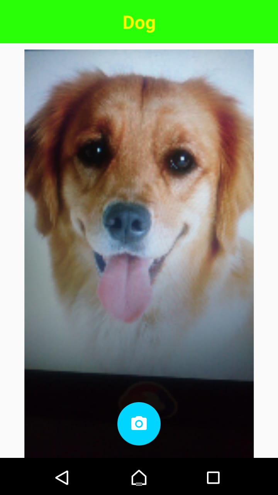

# NotDog

[NotDog](https://not-dog-io.firebaseapp.com) is the Shazam of animals. It tells you whether you have a dog or not.
It is based on the [Not HotDog app](https://www.seefoodtechnologies.com/nothotdog/) developed by See Food Technologies.

  
  

## Built With
- [ML Kit for Firebase](https://firebase.google.com/products/ml-kit)

## Contribuiting
Anyone and everyone is welcome to contribute. Please take a moment to
review the [contributing guidelines](CONTRIBUTING.md).

## License
This project is licensed under the MIT License - see the [LICENSE.md](LICENSE.md) file for details

## Acknowledgmens
The project makes uses of the following libraries
- [Glide](https://bumptech.github.io/glide/)
- [Nahu](https://github.com/PauloEnoque/Nahu)
